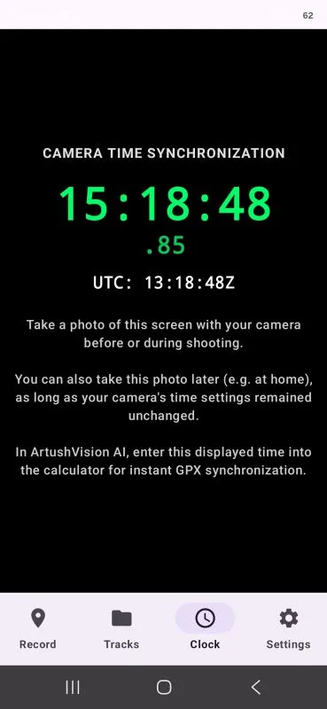
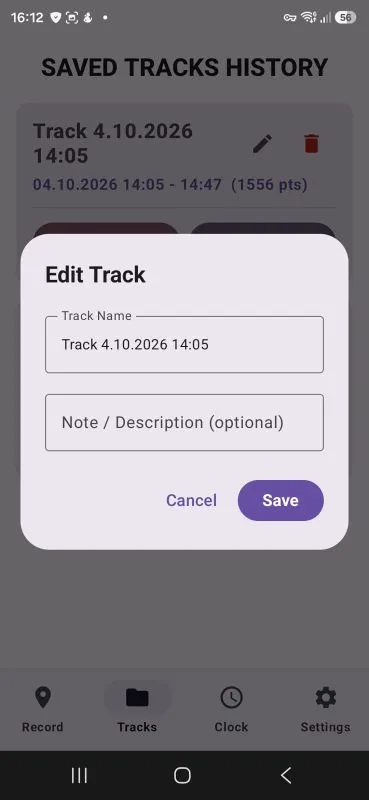
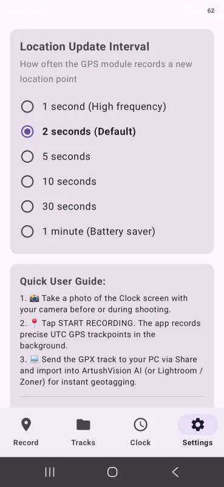
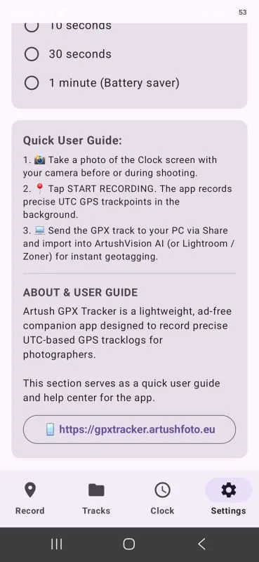
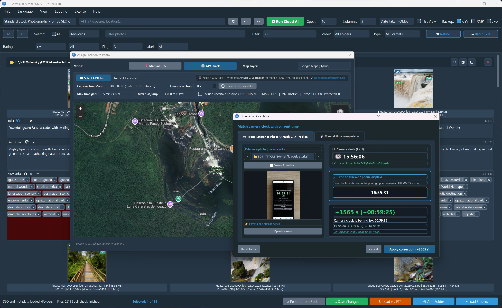
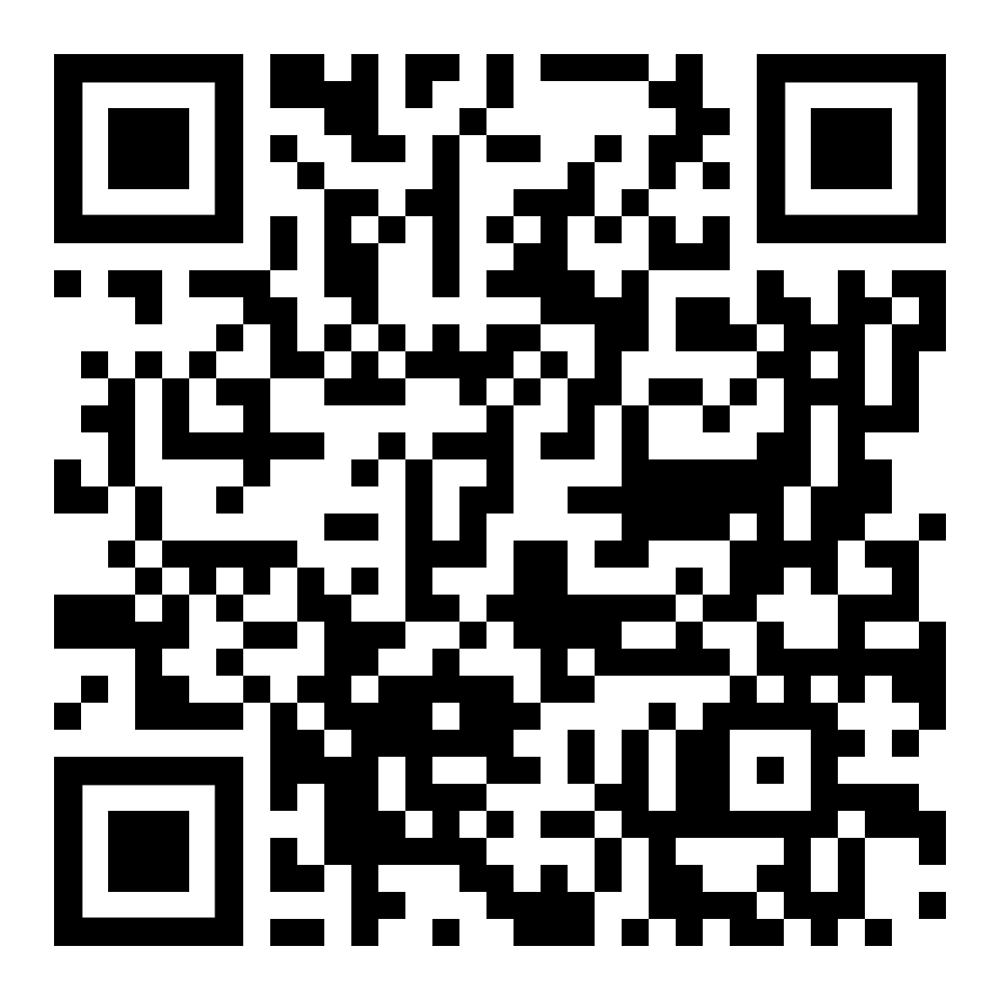

<!-- Cookie Consent Styly a Skript -->
<link rel="stylesheet" href="https://cdn.jsdelivr.net/npm/cookieconsent@3/build/cookieconsent.min.css" />

# Free Artush GPX Tracker

  <object type="image/svg+xml" data="artushGPXtracker.svg" title="Artush GPX Tracker" style="width: 100%; height: auto; aspect-ratio: 841.89 / 200; display: block; border: none; margin: 0; padding: 0; pointer-events: auto !important;">
    
  </object>

**Lightweight, single-purpose, and ad-free Android GPS logger designed for photographers.**

**Artush GPX Tracker** provides straightforward, precise GPS track recording in **UTC** time. It is crafted as the ideal mobile companion for matching geographic coordinates to photos in [**ArtushVision AI - Professional Metadata Automation**](https://vision.artushfoto.eu), as well as in any other photo editor that supports GPX geotagging.

---

## How Does Photo Geotagging Work?

**Add GPS location to your photos even if your camera doesn't have built-in GPS!**
You don't need a special camera, GPS accessories, or complicated cables. All you need is your smartphone and a simple GPS tracking app.

### 1. Your Phone Records Where You Go
Start **Artush GPX Tracker** on your phone before you begin taking pictures. Keep it in your pocket or camera bag.
The app automatically records your location and the exact time as you move around. It saves everything in a standard `.gpx` track file.

### 2. Your Camera Records When You Take Photos
Every time you press the shutter, your camera saves the date and time of the shot inside the photo.
This works with virtually any digital camera, including older DSLR models without GPS.

### 3. Your Photos Get Their GPS Location
After your photoshoot, simply load your photos and GPX track into [ArtushVision AI - Professional Metadata Automation](https://vision.artushfoto.eu), Lightroom Classic, digiKam, or other compatible software.
The software matches the time of each photo with your recorded GPS track and automatically finds where you took the picture.
It then adds the GPS coordinates to your photo's metadata.

**That's it!** Your photos now contain their geographical location, ready for sorting, mapping, and uploading to stock photography agencies.

---

### Why Should You Synchronize Your Camera Clock?

Your camera and phone need to agree on the time to correctly match photos with GPS locations.

Over time, your camera's internal clock may become a few seconds or even minutes inaccurate.

Artush GPX Tracker includes a simple solution:

1. Open the Clock screen in the app.
2. Take a photograph of your phone's displayed clock using your camera.
3. Load this reference photo into ArtushVision AI.
4. The software automatically calculates the time difference and corrects the synchronization.

**No manual calculations. No guessing. Even older cameras can produce accurately geotagged photos.**

---

### Perfect for Every Photography Adventure

Whether you photograph wildlife, landscapes, nature or travel, Artush GPX Tracker quietly records your journey in the background.

* **Wildlife Photography:** Record the exact locations where you photograph animals, even during long waits in one place.
* **Landscape Photography:** Remember the exact viewpoints and locations of your favorite compositions.
* **Travel Photography:** Keep a GPS record of your entire photographic journey.
* **Nature Photography:** Easily find the locations of plants, flowers and other natural subjects.

Your phone records the locations. Your camera captures the moments. Your photos remember both.

---

  
  
  
  

## Key Features and Benefits
Everything you need to remember where you took your photos – simple, reliable and ready for your next photography adventure.

* **Accurate GPS Recording**
Record your geographic locations with precise timestamps, making it easy to match your photos with the correct GPS coordinates.

* **Continuous Location Tracking**
Your phone records your location even when you stop moving to photograph wildlife, landscapes or other subjects.

* **Safe Track Storage**
Your recorded GPS tracks are saved and remain available when you close the app or restart your phone.

* **Simple and Easy to Use**
A clean, intuitive interface makes GPS tracking easy on different Android phone screens.

* **Track History & Management**
View, browse, rename and manage your previously recorded photography trips.

* **Interactive Map**
See your recorded routes and discover exactly where you took your photographs.

* **Camera Clock Synchronization**
Easily check and correct your camera's clock to ensure your photos receive the right GPS locations.

* **Standard GPX Export**
Export your GPS tracks in the widely supported GPX format and use them with [**ArtushVision AI - Professional Metadata Automation**](https://vision.artushfoto.eu), Lightroom-compatible workflows and other geotagging software.

* **Customizable Settings & Multilingual Support:** 
Easily toggle between languages (Czech, English, German, Spanish, French, Italian, Polish, Slovak, Portuguese, Russian, Hungarian, Ukrainian, Vietnamese, Korean, Chinese, Japanese, Arabic, Hebrew, Turkish) and adjust logging intervals (1s to 1min).

---

## App Controls & Navigation

The app is organized into 4 clear tabs in the bottom navigation bar:

### 1. Record
* **Tracking HUD:**
  * **Service:** Indicates live tracking status (`SERVICE ACTIVE` / `SERVICE STOPPED`).
  * **Start & Duration:** Displays start time in UTC and a live elapsed timer.
  * **Fix Quality:** Instant visual indicator of GPS accuracy (🟢 High Accuracy, 🟠 Usable, 🔴 No Signal).
  * **Telemetry:** Displays the age of the latest point, accuracy in meters, altitude, and total recorded points.
* **Action Buttons:**
  * **[Show on Map]:** Opens Google Maps centered on your current location.
  * **[▶ START LOGGING / ■ STOP LOGGING]:** Starts or stops background track recording. When starting, the app prompts you to either continue the existing track or begin a new one.
  * **[Map]:** Opens the complete GPX track in Mapy.cz or Google Earth.
  * **[Share]:** Instantly sends the GPX file to your PC or cloud storage (Quick Share, Email, Google Drive).

### 2. Tracks
* Complete history of all stored tracks.
* Each entry shows title, date, start/end timestamps, and recorded point count.
* **Track Actions:**
  * ✏ **Rename Track** (e.g., *Iguazu Falls - Autumn Shoot*).
  * 📝 **Add Note / Description**. (Exported alongside GPX as a .txt file with the same name)
  * 🗺️ **Open in Map App**.
  * 📤 **Share GPX**.
  * 🗑️ **Delete Track**.

### 3. Clock
* Pure black AMOLED background with large local and UTC time displays, including milliseconds.
* Photograph this screen with your camera before or during your shoot. Then, enter the visible time into the [**ArtushVision AI - Professional Metadata Automation**](https://vision.artushfoto.eu) time-shift calculator to synchronize photos with your GPX track automatically.

  
  
  
  

---

## Photo Geotagging & Synchronization

Exported `.gpx` files strictly follow the **GPX 1.1** standard, ensuring compatibility with all major geotagging software:

### 1. ArtushVision AI (Recommended) 💻
[**ArtushVision AI – Professional Metadata Automation**](https://vision.artushfoto.eu) is an advanced Windows desktop tool for automated captioning, keyword management, and rapid GPS track synchronization:
* **Effortless Time Offset Calculation**: Simply load the reference photo of the Artush GPX Tracker's **Clock Sync** screen and enter the time displayed on it. ArtushVision AI instantly compares that time against the photo's capture timestamp and calculates the exact time difference automatically.
* **Precise Geotagging**: The application writes the synchronized GPS coordinates directly into your photos' EXIF/XMP metadata.

### 2. Adobe Lightroom Classic
* In the **Map** module, select *Tracklog ➔ Load Tracklog...* and pick the file exported from Artush GPX Tracker.
* Lightroom automatically positions photos on the map using matching EXIF timestamps.

### 3. Zoner Photo Studio X
* In the **Manager** module, select your photos and go to *Map ➔ Assign GPS from GPX File...*.

### 4. Other Compatible Software
* **GeoSetter**, **Darktable**, **DigiKam**, **Apple Photos**, and any other software supporting GPX 1.1.

---

## Installation

1. **Download the APK:** Scan the QR code below using your mobile device or click the link to download the installation package directly to your Android phone. *(Note: Official Google Play release is currently in progress).*
2. **Installation Guide**: When installing the APK manually outside Google Play, Android will prompt you to grant permission to **"Install unknown apps"** for your web browser or file manager.
3. **Complete Installation:** Open the downloaded file, confirm the installation, and you are ready to start tracking your GPS routes.

---

## Links & Downloads

* **Artush GPX Tracker (🤖 Android Mobile App)** Will be available soon (Google Play approval is in process)

[**Click here to become a beta tester for Artush GPX Tracker, or scan the QR code with your phone.**](https://play.google.com/apps/testing/com.artush.gpxtracker)
    

  

---

[**ArtushVision AI - Professional Metadata Automation (Desktop Software)**](https://vision.artushfoto.eu)
* The Ultimate AI-Powered Workstation for Metadata, Asset Management, and Global & FTP Distribution.
---

### Privacy, Permissions & Security

* **Location Permission Only**: The application requires only **location access** (*Foreground* and *Background Location*) exclusively to record your route coordinates into GPX tracks. It does not request access to your private files, contacts, camera, or microphone.

[📷 Developer's Photography Portfolio: artushfoto.eu](https://artushfoto.eu)

---

*ArtushVision AI — intelligent metadata optimization for professional photography workflows.*

<!-- Odložené a podmíněné načtení Google Analytics s ohledem na Cookie Consent -->
