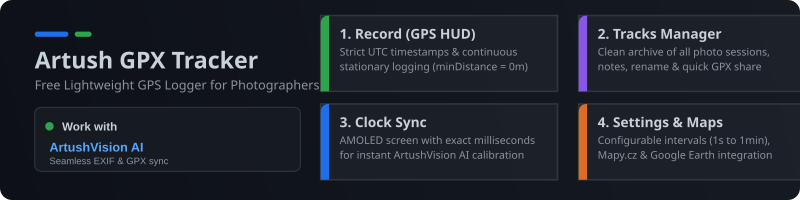
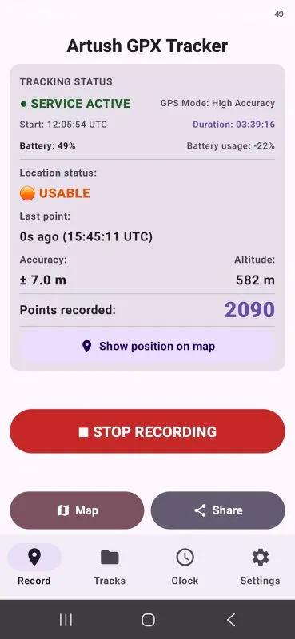
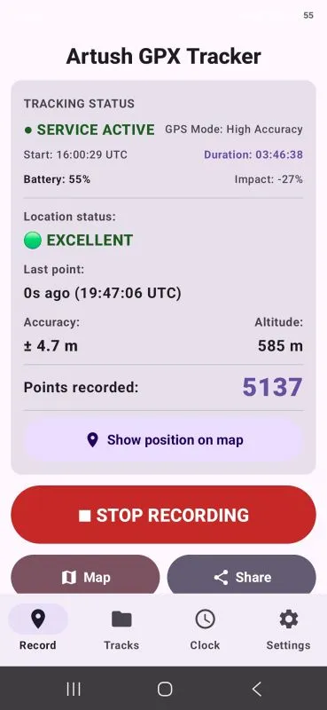
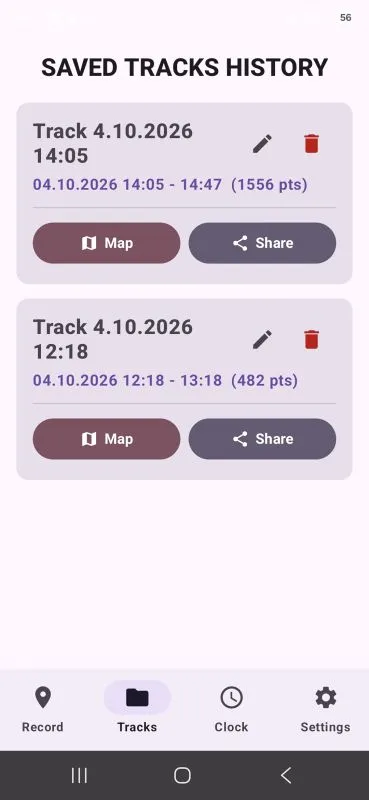

# Free Artush GPX Tracker

  <object type="image/svg+xml" data="artushGPXtracker.svg" title="Artush GPX Tracker" style="width: 100%; height: auto; aspect-ratio: 841.89 / 200; display: block; border: none; margin: 0; padding: 0; pointer-events: auto !important;">
    
  </object>

**Lightweight, single-purpose, and ad-free Android GPS logger designed for photographers.**

Artush GPX Tracker provides straightforward, precise GPS track recording in **UTC** time. It is crafted as the ideal mobile companion for matching geographic coordinates to photos in **ArtushVision AI**, as well as in any other photo editor that supports GPX geotagging.

---

<table>
  <tr>
    <th align="center">Start Recording</th>
    <th align="center">Active Recording</th>
    <th align="center">Track List</th>
  </tr>
  <tr>
    <td align="center" valign="top">
      
    </td>
    <td align="center" valign="top">
      
    </td>
    <td align="center" valign="top">
      
    </td>
  </tr>
</table>

## 🌟 Key Features and Benefits

* **Strict UTC Timestamp (ISO-8601):** All track points are saved in pure satellite UTC time, eliminating time offsets and daylight saving shifts.
* **Continuous Logging While Stationary (`minDistance = 0 m`):** The app never drops points, even when a photographer stays in one place for an extended period (e.g., at a scenic viewpoint or in a studio).
* **SQLite Database Storage (Room):** Every coordinate is written to internal memory immediately. Recorded data remains safe even if your battery dies or the phone restarts.
* **Fully Responsive Layout for All Devices:** Typography and interface elements scale dynamically so key controls remain visible on screen without requiring extra scrolling.
* **Track History & Manager ("Tracks"):** A clean archive of all your photo sessions. Rename tracks, add notes, view paths in external maps, or delete them anytime.
* **Smart Map Integration:** Direct links to **Mapy.com**, **Google Earth**, and Google Maps. If no compatible GPX viewer is installed, the app provides convenient Google Play links alongside a fallback map preview.
* **Camera Clock Sync ("Clock"):** A dedicated high-contrast screen displaying exact time down to the millisecond. Photograph the screen before or during your shoot, then enter the visible time into **ArtushVision AI** for instant clock calibration.
* **Bilingual Interface (English / Czech):** Toggle between languages and adjust logging intervals (1s to 1min) directly in settings.

---

## 🧭 App Controls & Navigation

The app is organized into 4 clear tabs in the bottom navigation bar:

### 1. Record
* **Tracking HUD:**
  * **Service:** Indicates live tracking status (`SERVICE ACTIVE` / `SERVICE STOPPED`).
  * **Start & Duration:** Displays start time in UTC and a live elapsed timer.
  * **Fix Quality:** Instant visual indicator of GPS accuracy (🟢 High Accuracy, 🟠 Usable, 🔴 No Signal).
  * **Telemetry:** Displays the age of the latest point, accuracy in meters, altitude, and total recorded points.
* **Action Buttons:**
  * **[Show on Map]:** Opens Google Maps centered on your current location.
  * **[▶ START LOGGING / ■ STOP LOGGING]:** Starts or stops background track recording. When starting, the app prompts you to either continue the existing track or begin a new one.
  * **[Map]:** Opens the complete GPX track in Mapy.cz or Google Earth.
  * **[Share]:** Instantly sends the GPX file to your PC or cloud storage (Quick Share, Email, Google Drive).

### 2. Tracks
* Complete history of all stored tracks.
* Each entry shows title, date, start/end timestamps, and recorded point count.
* **Track Actions:**
  * ✏ **Rename Track** (e.g., *Křivoklátsko - Autumn Shoot*).
  * 📝 **Add Note / Description**.
  * 🗺️ **Open in Map App**.
  * 📤 **Share GPX**.
  * 🗑️ **Delete Track**.

### 3. Clock
* Pure black AMOLED background with large local and UTC time displays, including milliseconds.
* Photograph this screen with your camera before or during your shoot. Then, enter the visible time into the **ArtushVision AI** time-shift calculator to synchronize photos with your GPX track automatically.

### 4. Settings
* **Location Update Interval:** Select your recording frequency from 1 second (maximum precision) to 1 minute (battery saver).
* **App Language:** Switch between English and Czech.
* **Links & About:** Direct links to download the mobile tracker and the **ArtushVision AI** desktop application.

---

## 📷 Photo Geotagging & Synchronization

Exported `.gpx` files strictly follow the **GPX 1.1** standard, ensuring compatibility with all major geotagging software:

### 1. ArtushVision AI (Recommended) 💻
[ArtushVision AI](https://vision.artushfoto.eu) is an advanced desktop tool for automated captioning, keyword management, and rapid GPS track synchronization:
* Reads your reference photo of the **Clock** screen to calculate camera clock offsets automatically.
* Writes accurate GPS coordinates directly into EXIF/XMP photo metadata.

### 2. Adobe Lightroom Classic
* In the **Map** module, select *Tracklog ➔ Load Tracklog...* and pick the file exported from Artush GPX Tracker.
* Lightroom automatically positions photos on the map using matching EXIF timestamps.

### 3. Zoner Photo Studio X
* In the **Manager** module, select your photos and go to *Map ➔ Assign GPS from GPX File...*.

### 4. Other Compatible Software
* **GeoSetter**, **Darktable**, **DigiKam**, **Apple Photos**, and any other software supporting GPX 1.1.

---

## 📥 Installation

1. **Download the APK:** Scan the QR code below using your mobile device or click the link to download the installation package directly to your Android phone. *(Note: Official Google Play release is currently in progress).*
2. **Allow Installation from Unknown Sources:** Because this is a direct APK release, your phone may prompt you to temporarily allow app installation from unknown sources in your device security settings.
3. **Complete Installation:** Open the downloaded file, confirm the installation, and you are ready to start tracking your GPS routes.

---

## 🌐 Links & Downloads

* **Artush GPX Tracker (Mobile App):** [https://tracker.artushfoto.eu](https://tracker.artushfoto.eu)
* **ArtushVision AI (Desktop Software):** [https://vision.artushfoto.eu](https://vision.artushfoto.eu)